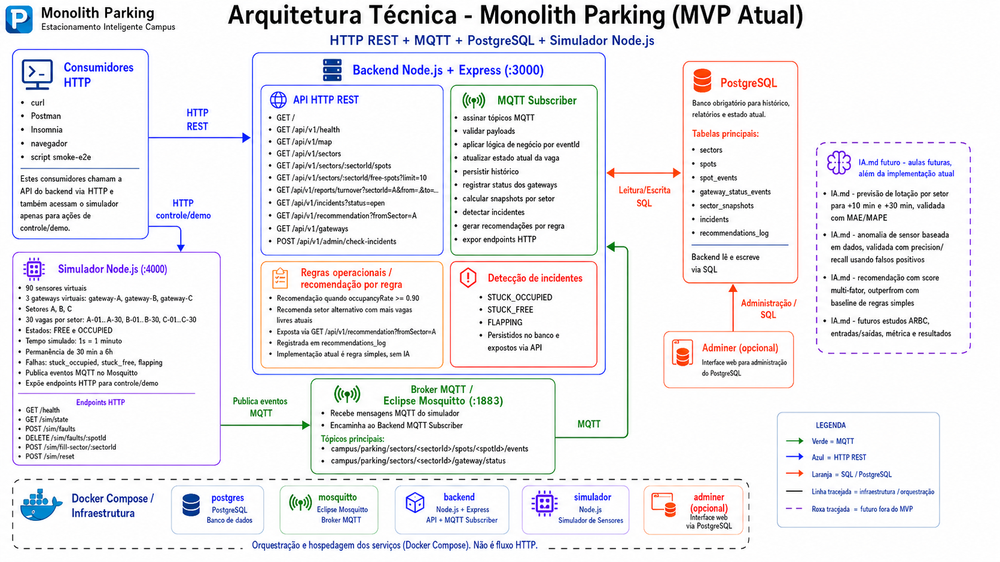

# Monolith Parking

Sistema de estacionamento inteligente para campus, com sensores simulados, eventos MQTT, persistência histórica, API HTTP, recomendações operacionais, incidentes e base para dashboard.

## Escopo do projeto

O sistema acompanha 90 vagas distribuídas em três setores (`A`, `B`, `C`). Cada vaga recebe eventos de estado (`FREE` ou `OCCUPIED`) publicados por gateways via MQTT. O backend valida e persiste os eventos, atualiza o estado atual, calcula ocupação por setor e disponibiliza dados para API, relatórios e dashboard.



## Módulos

| Módulo | Responsável | Status neste repositório |
| --- | --- | --- |
| Simulador IoT/MQTT | Roger | Contrato definido |
| Ingestão MQTT | Nicolas | Contrato definido |
| Banco de dados | Morgado | Implementado em `backend/database` |
| API HTTP, recomendações e incidentes | Seisdedo | Contrato definido |
| Integração, Docker e demo | Will | Contrato definido |

## Contratos principais

### Tópicos MQTT

```txt
campus/parking/sectors/<sectorId>/spots/<spotId>/events
campus/parking/sectors/<sectorId>/gateway/status
```

### Payload de evento de vaga

```json
{
  "eventId": "uuid",
  "ts": "2026-04-29T10:15:30.000Z",
  "sectorId": "A",
  "spotId": "A-07",
  "state": "OCCUPIED",
  "source": "gateway"
}
```

### Endpoints HTTP previstos

```txt
GET /api/v1/map
GET /api/v1/sectors
GET /api/v1/sectors/:sectorId/spots
GET /api/v1/sectors/:sectorId/free-spots?limit=10
GET /api/v1/reports/turnover?sectorId=A&from=...&to=...
GET /api/v1/incidents?status=open
GET /api/v1/recommendation?fromSector=A
```

## Banco de dados

O projeto usa PostgreSQL. A implementação está em [backend/database](backend/database/README.md).

Tabelas obrigatórias:

- `spots`
- `spot_events`
- `sector_snapshots`
- `incidents`
- `recommendations_log`

O banco também inclui estruturas de apoio para gateways, sensores, sessões de permanência, políticas de recomendação, rotas internas, navegação e gamificação.

## Ambiente padrão

| Contexto | Host | Porta |
| --- | --- | --- |
| Scripts locais e ferramentas como DBeaver | `localhost` | `5432` |
| Serviços dentro do Docker Compose | `postgres` | `5432` |
| Banco compartilhado do grupo | definido em `DATABASE_URL` | `5432` |

O host remoto compartilhado não fica embutido no repositório. A URL real deve ser criada pelo grupo e compartilhada fora do Git.

## Como rodar o banco local

```powershell
cd backend/database
Copy-Item .env.example .env
npm install
docker compose up -d
npm run check:requirements
npm run check:db
```

## Documentação

- [Plano de trabalho](tasks.md)
- [Contrato do banco](backend/database/README.md)
- [Contrato de ambiente](backend/database/CONTRATO_AMBIENTE.md)
- [Mapa do modelo de dados](backend/database/MAPEAMENTO_BANCO.md)
- [ERD](backend/database/ERD_BANCO.md)
