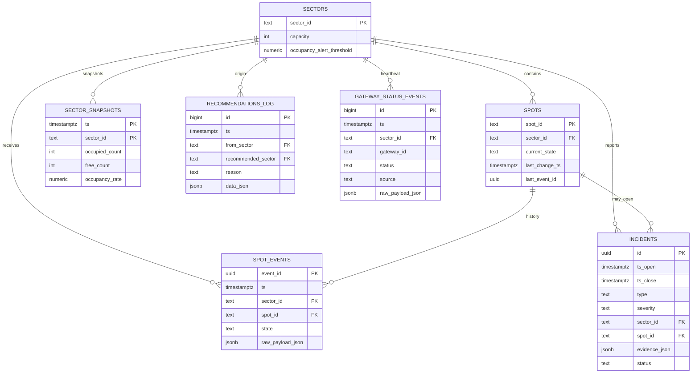

# ERD do banco

Diagrama conceitual do schema fisico do MVP.

```mermaid
erDiagram
  SECTORS ||--o{ SPOTS : contains
  SECTORS ||--o{ SPOT_EVENTS : receives
  SECTORS ||--o{ SECTOR_SNAPSHOTS : snapshots
  SECTORS ||--o{ INCIDENTS : reports
  SECTORS ||--o{ RECOMMENDATIONS_LOG : origin
  SECTORS ||--o{ GATEWAY_STATUS_EVENTS : heartbeat
  SPOTS ||--o{ SPOT_EVENTS : history
  SPOTS ||--o{ INCIDENTS : may_open

  SECTORS {
    text sector_id PK
    int capacity
    numeric occupancy_alert_threshold
  }

  SPOTS {
    text spot_id PK
    text sector_id FK
    text current_state
    timestamptz last_change_ts
    uuid last_event_id
  }

  SPOT_EVENTS {
    uuid event_id PK
    timestamptz ts
    text sector_id FK
    text spot_id FK
    text state
    jsonb raw_payload_json
  }

  GATEWAY_STATUS_EVENTS {
    bigint id PK
    timestamptz ts
    text sector_id FK
    text gateway_id
    text status
    text source
    jsonb raw_payload_json
  }

  SECTOR_SNAPSHOTS {
    timestamptz ts PK
    text sector_id PK
    int occupied_count
    int free_count
    numeric occupancy_rate
  }

  INCIDENTS {
    uuid id PK
    timestamptz ts_open
    timestamptz ts_close
    text type
    text severity
    text sector_id FK
    text spot_id FK
    jsonb evidence_json
    text status
  }

  RECOMMENDATIONS_LOG {
    bigint id PK
    timestamptz ts
    text from_sector FK
    text recommended_sector FK
    text reason
    jsonb data_json
  }
```
