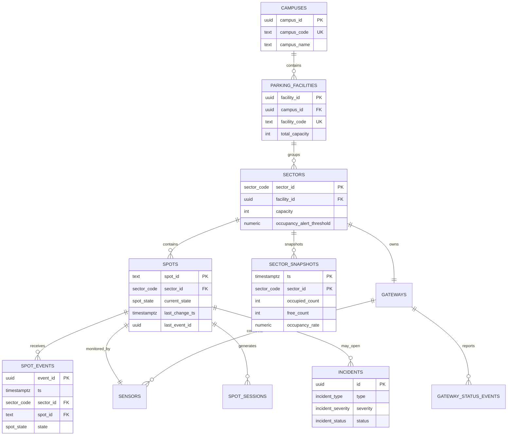
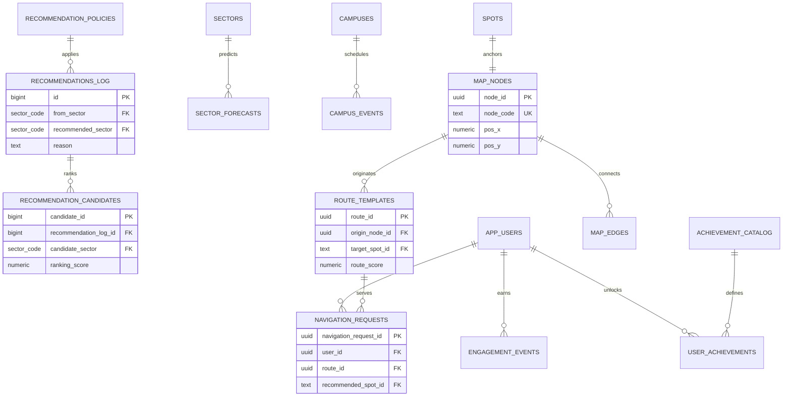

# ERD do banco

Diagrama conceitual das entidades principais. O schema fisico esta nos arquivos SQL em `init/`.

## Operacao principal

```mermaid
erDiagram
  CAMPUSES ||--o{ PARKING_FACILITIES : contains
  PARKING_FACILITIES ||--o{ SECTORS : groups
  SECTORS ||--o{ SPOTS : contains
  SECTORS ||--o{ SECTOR_SNAPSHOTS : snapshots
  SECTORS ||--|| GATEWAYS : owns
  GATEWAYS ||--o{ SENSORS : connects
  SPOTS ||--|| SENSORS : monitored_by
  SPOTS ||--o{ SPOT_EVENTS : receives
  SPOTS ||--o{ SPOT_SESSIONS : generates
  SPOTS ||--o{ INCIDENTS : may_open
  GATEWAYS ||--o{ GATEWAY_STATUS_EVENTS : reports

  CAMPUSES {
    uuid campus_id PK
    text campus_code UK
    text campus_name
  }
  PARKING_FACILITIES {
    uuid facility_id PK
    uuid campus_id FK
    text facility_code UK
    int total_capacity
  }
  SECTORS {
    sector_code sector_id PK
    uuid facility_id FK
    int capacity
    numeric occupancy_alert_threshold
  }
  SPOTS {
    text spot_id PK
    sector_code sector_id FK
    spot_state current_state
    timestamptz last_change_ts
    uuid last_event_id
  }
  SPOT_EVENTS {
    uuid event_id PK
    timestamptz ts
    sector_code sector_id FK
    text spot_id FK
    spot_state state
  }
  SECTOR_SNAPSHOTS {
    timestamptz ts PK
    sector_code sector_id PK
    int occupied_count
    int free_count
    numeric occupancy_rate
  }
  INCIDENTS {
    uuid id PK
    incident_type type
    incident_severity severity
    incident_status status
  }
```

## Recomendacao, previsao e navegacao

```mermaid
erDiagram
  RECOMMENDATION_POLICIES ||--o{ RECOMMENDATIONS_LOG : applies
  RECOMMENDATIONS_LOG ||--o{ RECOMMENDATION_CANDIDATES : ranks
  SECTORS ||--o{ SECTOR_FORECASTS : predicts
  CAMPUSES ||--o{ CAMPUS_EVENTS : schedules
  APP_USERS ||--o{ NAVIGATION_REQUESTS : requests
  APP_USERS ||--o{ ENGAGEMENT_EVENTS : earns
  APP_USERS ||--o{ USER_ACHIEVEMENTS : unlocks
  ACHIEVEMENT_CATALOG ||--o{ USER_ACHIEVEMENTS : defines
  MAP_NODES ||--o{ MAP_EDGES : connects
  MAP_NODES ||--o{ ROUTE_TEMPLATES : originates
  ROUTE_TEMPLATES ||--o{ NAVIGATION_REQUESTS : serves
  SPOTS ||--|| MAP_NODES : anchors

  RECOMMENDATIONS_LOG {
    bigint id PK
    sector_code from_sector FK
    sector_code recommended_sector FK
    text reason
  }
  RECOMMENDATION_CANDIDATES {
    bigint candidate_id PK
    bigint recommendation_log_id FK
    sector_code candidate_sector FK
    numeric ranking_score
  }
  MAP_NODES {
    uuid node_id PK
    text node_code UK
    numeric pos_x
    numeric pos_y
  }
  ROUTE_TEMPLATES {
    uuid route_id PK
    uuid origin_node_id FK
    text target_spot_id FK
    numeric route_score
  }
  NAVIGATION_REQUESTS {
    uuid navigation_request_id PK
    uuid user_id FK
    uuid route_id FK
    text recommended_spot_id FK
  }
```
